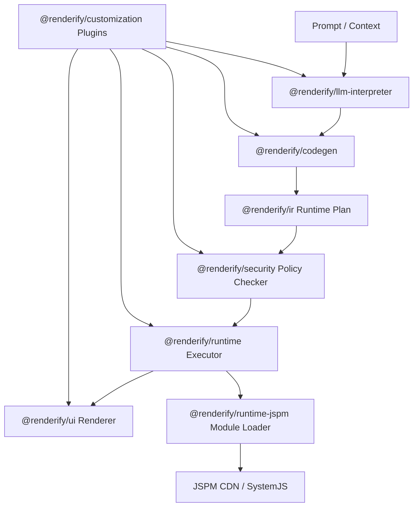

# Renderify

> Runtime-first UI: interpret -> plan -> policy-check -> execute -> render, without build-per-change for product UI iteration.

Renderify is a runtime-first UI engine that executes LLM-generated JSX/TSX directly in the browser via Babel and JSPM, with no build or publish step.

## Why Renderify

Most AI UI stacks stop at generation + preview, then require build/deploy to become usable.

Renderify focuses on:

- Runtime-direct rendering (validated plans execute immediately)
- Controlled dynamic execution (policy-first, not unrestricted eval)
- Stateful runtime transitions (event -> actions -> updated UI)
- Traceable rollback/replay with audit logs
- Swappable adapters (LLM, module loader, renderer, plugins)

## Runtime Pipeline



## Implemented Capabilities

- Versioned plan registry with rollback
- Execution audit log with replay
- Stateful plan model:
  - `state.initial`
  - `state.transitions[eventType] -> actions[]`
  - action types: `set`, `increment`, `toggle`, `push`
  - value sources: `state.*`, `event.*`, `context.*`, `vars.*`
- Runtime quotas and limits:
  - `maxImports`
  - `maxExecutionMs`
  - `maxComponentInvocations`
- Runtime sandbox profile:
  - `executionProfile: "isolated-vm"` for VM-isolated sync component execution
- LLM structured contract:
  - prompt flow prefers structured `runtime-plan` output
  - auto fallback to text generation when structured payload is invalid
- TSX/JSX runtime source pipeline:
  - `codegen` extracts fenced `tsx/jsx/ts/js` blocks into `plan.source`
  - runtime transpiles source via Babel (browser `@babel/standalone`)
  - import specifiers are resolved through JSPM loader strategy
- Real OpenAI provider adapter (`@renderify/llm-openai`) with structured JSON schema requests
- Security policy checks for state transitions and quota requests
- Security profiles: `strict | balanced | relaxed`
- Tenant quota governance:
  - max executions per minute
  - max concurrent executions
  - throttled audit status on quota exceed
  - enforced in long-running runtime process (e.g. playground/server mode)
- RuntimePlan structural guards for safer plan ingestion
- Browser runtime playground (`renderify playground`) for live prompt/plan/event/state/history flows
- CLI persisted history (`.renderify/session.json`)
- Unit tests for `ir/codegen/security/runtime/core`
- CI workflow (`lint + typecheck + unit + build + e2e`)

## Monorepo Commands

```bash
# install
pnpm install

# quality + tests
pnpm lint
pnpm typecheck
pnpm unit
pnpm e2e
pnpm test

# package quality and builds
pnpm validate
pnpm build

# auto-format
pnpm format
```

## CLI Quick Start

```bash
# Render prompt and print HTML
pnpm cli -- run "Build a welcome card"

# Print RuntimePlan JSON
pnpm cli -- plan "Build a welcome card"

# Execute RuntimePlan file
pnpm cli -- render-plan examples/runtime/counter-plan.json

# Dispatch runtime event to a stored plan
pnpm cli -- event <planId> increment '{"delta":1}'

# Inspect runtime state and history
pnpm cli -- state <planId>
pnpm cli -- history

# Rollback / replay
pnpm cli -- rollback <planId> <version>
pnpm cli -- replay <traceId>

# Browser playground
pnpm playground

# Optional security/tenant env
RENDERIFY_SECURITY_PROFILE=strict pnpm playground
RENDERIFY_MAX_EXECUTIONS_PER_MINUTE=60 RENDERIFY_MAX_CONCURRENT_EXECUTIONS=2 pnpm playground
RENDERIFY_LLM_USE_STRUCTURED_OUTPUT=false pnpm playground

# Optional LLM provider env
RENDERIFY_LLM_PROVIDER=openai RENDERIFY_LLM_API_KEY=<your_key> pnpm playground
RENDERIFY_LLM_PROVIDER=openai RENDERIFY_LLM_MODEL=gpt-4.1-mini RENDERIFY_LLM_BASE_URL=https://api.openai.com/v1 pnpm playground

# Force text/TSX generation path instead of structured RuntimePlan
RENDERIFY_LLM_USE_STRUCTURED_OUTPUT=false pnpm playground
```

## Release Flow

```bash
# add a release note for changed packages
pnpm changeset

# apply versions/changelog updates
pnpm version-packages

# publish packages
pnpm release
```

## Programmatic Example

```ts
import { createRenderifyApp } from "@renderify/core";
import { DefaultRenderifyConfig } from "@renderify/config";
import { DefaultContextManager } from "@renderify/context";
import { DefaultLLMInterpreter } from "@renderify/llm-interpreter";
import { DefaultCodeGenerator } from "@renderify/codegen";
import { DefaultRuntimeManager } from "@renderify/runtime";
import { JspmModuleLoader } from "@renderify/runtime-jspm";
import { DefaultSecurityChecker } from "@renderify/security";
import { DefaultPerformanceOptimizer } from "@renderify/performance";
import { DefaultUIRenderer } from "@renderify/ui";

const app = createRenderifyApp({
  config: new DefaultRenderifyConfig(),
  context: new DefaultContextManager(),
  llm: new DefaultLLMInterpreter(),
  codegen: new DefaultCodeGenerator(),
  runtime: new DefaultRuntimeManager({
    moduleLoader: new JspmModuleLoader(),
  }),
  security: new DefaultSecurityChecker(),
  performance: new DefaultPerformanceOptimizer(),
  ui: new DefaultUIRenderer(),
});

await app.start();

const planResult = await app.renderPrompt("Build a runtime counter");
await app.dispatchEvent(planResult.plan.id, {
  type: "increment",
  payload: { delta: 1 },
});

console.log(app.getPlanState(planResult.plan.id));
await app.stop();
```

## Package Topology

| Package | Responsibility |
| --- | --- |
| `@renderify/ir` | Runtime IR contracts (plan/node/state/action/event/capabilities) |
| `@renderify/security` | Policy guardrails for plan, transitions, and module capabilities |
| `@renderify/runtime` | Runtime execution engine and state transition evaluator |
| `@renderify/runtime-jspm` | JSPM/SystemJS module loader adapter |
| `@renderify/ui` | Runtime HTML/DOM renderer |
| `@renderify/core` | End-to-end pipeline orchestration and lifecycle APIs |
| `@renderify/customization` | Hook-based plugin extension system |
| `@renderify/codegen` | LLM output -> RuntimePlan conversion |
| `@renderify/llm-interpreter` | LLM abstraction layer |
| `@renderify/llm-openai` | OpenAI-backed `LLMInterpreter` adapter |
| `@renderify/config` | Runtime/security config source |
| `@renderify/context` | Context state and subscriptions |
| `@renderify/performance` | Pipeline metrics collection |
| `@renderify/api-integration` | Typed external API invocation helper |
| `@renderify/component-library` | Reusable runtime-node constructors |
| `@renderify/cli` | CLI + browser playground |

## Integration Docs

- Runtime contracts: `docs/architecture/runtime-contracts.md`
- Framework design: `docs/architecture/framework-design.md`
- Implementation status: `docs/architecture/implementation-status.md`
- Plugin/loader integration guide: `docs/architecture/plugin-loader-integration.md`

## Browser Examples

- Runtime plan flow: `examples/runtime/browser-runtime-example.html`
- TSX runtime flow (Babel + JSPM): `examples/runtime/browser-tsx-jspm-example.html`

## Next Focus

- Production-grade sandbox isolation boundary (Worker/VM execution profile)
- Additional provider adapters and reliability strategies (retry, backoff, circuit breaking)
- Multi-tenant policy profile presets and quota governance

## License

MIT
