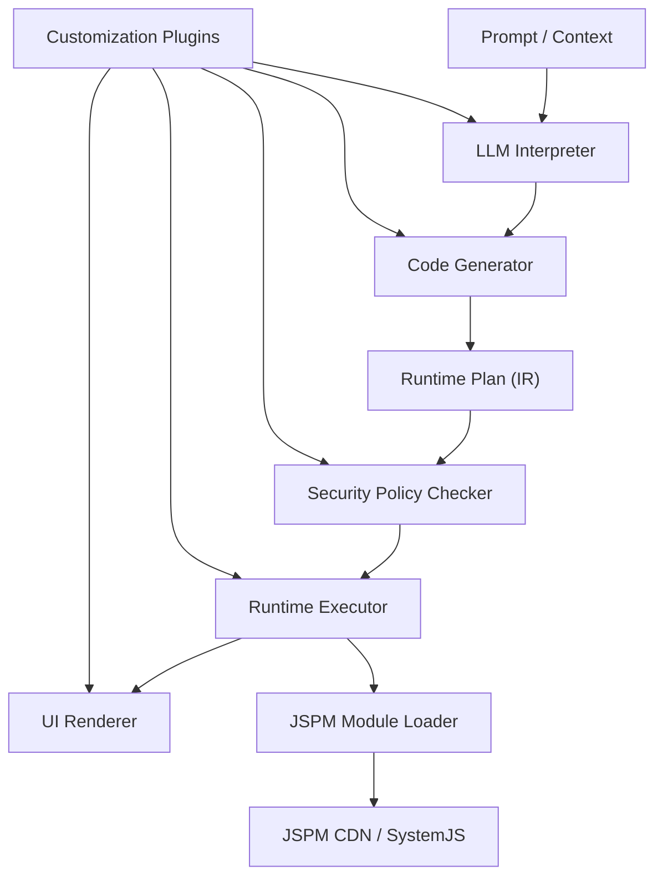

# Renderify

> LLM generates JSX/TSX → browser renders it directly at runtime — no compiler, no build step, any npm package from JSPM.
> Renderify is a runtime-first dynamic renderer that lets LLMs produce real, interactive UI on the fly. It bridges the gap between "LLM can generate code" and "users can see and interact with that UI instantly" — without a backend compiler or deploy pipeline in the loop.

## The Problem

LLMs are increasingly capable of generating UI code, but **there is no good way to render that output directly in the browser**:
| Existing Approach | Limitation |
| --- | --- |
| **v0 / Bolt.new** | Requires a full build backend (Next.js compile + deploy). Not embeddable as a runtime in your own app. |
| **Streamlit / Gradio** | Python-based, server-rendered. Not a frontend runtime. |
| **MCP UI** | Limited to Markdown + a small fixed component set. Cannot express arbitrary UI. |
| **Anthropic Artifacts** | Closed implementation, not open-source, not embeddable. |
| **JSON schema renderers (A2UI, json-render)** | LLM fills parameters into a predefined component catalog. Cannot express anything outside the schema. |
| **Sandpack / WebContainers** | Full in-browser bundlers — powerful but heavyweight, not optimized for the LLM → UI hot path. |
**The missing piece**: a lightweight, security-governed runtime where LLMs output JSX/TSX (or structured plans) and the browser renders it immediately — with access to the entire npm ecosystem via JSPM, without any compile step.

## What Renderify Does

```
LLM output (JSX/TSX or structured plan)
  → CodeGen (parse + normalize)
    → Security policy check (before any execution)
      → Runtime execution (Babel transpile + JSPM module resolution)
        → Rendered UI in the browser
```

- **Zero-build rendering**: LLM-generated JSX/TSX runs directly in the browser via `@babel/standalone` + JSPM CDN. No webpack, no vite, no server round-trip.
- **Any npm package at runtime**: Import `recharts`, `lodash`, `date-fns`, or any package available on JSPM — resolved and loaded on the fly.
- **Security-first execution**: Every plan passes through a policy checker (blocked tags, module allowlists, tree depth limits, execution budgets) _before_ any code runs. Three built-in profiles: `strict`, `balanced`, `relaxed`.
- **Dual input paths**: Accepts both structured JSON RuntimePlans (for precise LLM structured output) and raw TSX/JSX code blocks (for natural LLM text generation).
- **Streaming-first rendering**: `renderPromptStream` emits `llm-delta` / `preview` / `final` chunks so chat UIs can progressively render.
- **Pluggable at every stage**: 10 hook points (`beforeLLM`, `afterCodeGen`, `beforeRender`, etc.) let you inject custom logic without forking the core.

## Who This Is For

- **LLM chat / agent platforms** that need to render dynamic UI from model output (dashboards, forms, cards, data visualizations)
- **AI-powered tools** where the model generates UI on-the-fly based on user intent, tool results, or API data
- **Rapid prototyping** workflows where you want to go from prompt → rendered UI in seconds, not minutes
- **Any application** that needs to safely render untrusted, dynamically-generated UI in the browser

## Runtime Pipeline



## Implemented Capabilities

- Runtime plan model with optional `state.initial`
- Runtime quotas and limits:
  - `maxImports`
  - `maxExecutionMs`
  - `maxComponentInvocations`
- Runtime protocol contract:
  - `specVersion` (default `runtime-plan/v1`)
  - `moduleManifest` for deterministic module resolution
- JSX runtime modes:
  - `source.runtime: "renderify"` for RuntimeNode-oriented execution
  - `source.runtime: "preact"` for hooks + React-compatible component rendering
- Runtime sandbox profile:
  - `executionProfile: "isolated-vm"` for VM-isolated sync component execution
  - fail-closed by default when isolation runtime is unavailable
  - browser source sandbox with `sandbox-worker` / `sandbox-iframe` execution profiles
  - runtime-level controls: mode / timeout / fail-closed
- LLM structured contract:
  - prompt flow prefers structured `runtime-plan` output
  - auto fallback to text generation when structured payload is invalid
- TSX/JSX runtime source pipeline:
  - `codegen` extracts fenced `tsx/jsx/ts/js` blocks into `plan.source`
  - runtime transpiles source via Babel (browser `@babel/standalone`)
  - import specifiers are resolved via `es-module-lexer` + JSPM loader strategy (less regex fragility)
  - browser runtime rewrites source module graphs so transitive bare imports resolve at runtime
- Dependency preflight before execution:
  - probes `imports`, `component modules`, and `source imports`
  - optional fail-fast mode for CI/production gates
  - retry + timeout + multi-CDN fallback for remote module fetches
- Browser asset module proxying:
  - CSS imports are converted to runtime style-injection proxy modules
  - JSON imports are converted to ESM default exports
- React ecosystem compatibility bridge:
  - `react`, `react-dom`, `react-dom/client`, `react/jsx-runtime` are mapped to `preact/compat` equivalents
  - enables direct runtime rendering for React-first packages (e.g. `recharts`, `@mui/material`)
- LLM provider package (`@renderify/llm`) with built-in OpenAI, Anthropic, and Google providers
- Runtime source static policy checks (blocked patterns, dynamic import policy, source import count)
- Streaming prompt pipeline (`renderPromptStream`) with progressive preview updates
- Preact DOM reconciliation path for runtime source modules (diff-based UI updates)
- Security profiles: `strict | balanced | relaxed`
- RuntimePlan structural guards for safer plan ingestion
- One-line embed API: `renderPlanInBrowser(plan, { target })`
- Browser runtime playground (`renderify playground`) for live prompt/plan/stream/probe flows
- Unit tests for `ir/core/runtime`
- CI matrix (`Node 22 + Node 24`) for typecheck/unit + quality gates
- PR changeset enforcement for release-relevant package changes
- Benchmark workflow with JSON artifacts uploaded per CI run

## Monorepo Commands

```bash
# install
pnpm install

# quality + tests
pnpm lint
pnpm typecheck
pnpm unit
pnpm e2e
pnpm bench
pnpm test

# package quality and builds
pnpm validate
pnpm build

# auto-format
pnpm format
```

## CLI Quick Start

```bash
# Render prompt and print HTML
pnpm cli -- run "Build a welcome card"

# Print RuntimePlan JSON
pnpm cli -- plan "Build a welcome card"

# Probe RuntimePlan compatibility (policy + runtime preflight diagnostics)
pnpm cli -- probe-plan examples/runtime/recharts-dashboard-plan.json
# side-effect free: does not execute plan source/component logic

# Execute RuntimePlan file
pnpm cli -- render-plan examples/runtime/counter-plan.json

# Browser playground
pnpm playground

# Optional security env
RENDERIFY_SECURITY_PROFILE=strict pnpm playground
RENDERIFY_LLM_USE_STRUCTURED_OUTPUT=false pnpm playground

# Optional LLM provider env
RENDERIFY_LLM_PROVIDER=openai RENDERIFY_LLM_API_KEY=<your_key> pnpm playground
RENDERIFY_LLM_PROVIDER=openai RENDERIFY_LLM_MODEL=gpt-4.1-mini RENDERIFY_LLM_BASE_URL=https://api.openai.com/v1 pnpm playground
RENDERIFY_LLM_PROVIDER=anthropic RENDERIFY_LLM_API_KEY=<your_key> pnpm playground
RENDERIFY_LLM_PROVIDER=anthropic RENDERIFY_LLM_MODEL=claude-3-5-sonnet-latest RENDERIFY_LLM_BASE_URL=https://api.anthropic.com/v1 pnpm playground
RENDERIFY_LLM_PROVIDER=google RENDERIFY_LLM_API_KEY=<your_key> pnpm playground
RENDERIFY_LLM_PROVIDER=google RENDERIFY_LLM_MODEL=gemini-2.0-flash RENDERIFY_LLM_BASE_URL=https://generativelanguage.googleapis.com/v1beta pnpm playground

# Runtime protocol/runtime safety env
RENDERIFY_RUNTIME_ENFORCE_MANIFEST=true pnpm playground
RENDERIFY_RUNTIME_ALLOW_ISOLATION_FALLBACK=false pnpm playground
RENDERIFY_RUNTIME_SPEC_VERSIONS=runtime-plan/v1 pnpm playground
RENDERIFY_RUNTIME_PREFLIGHT=true RENDERIFY_RUNTIME_PREFLIGHT_FAIL_FAST=true pnpm playground
RENDERIFY_RUNTIME_REMOTE_FETCH_TIMEOUT_MS=12000 RENDERIFY_RUNTIME_REMOTE_FETCH_RETRIES=2 pnpm playground
RENDERIFY_RUNTIME_REMOTE_FALLBACK_CDNS=https://esm.sh,https://cdn.jsdelivr.net pnpm playground
RENDERIFY_RUNTIME_BROWSER_SANDBOX_MODE=worker RENDERIFY_RUNTIME_BROWSER_SANDBOX_TIMEOUT_MS=4000 pnpm playground
RENDERIFY_RUNTIME_BROWSER_SANDBOX_FAIL_CLOSED=true pnpm playground

# Force text/TSX generation path instead of structured RuntimePlan
RENDERIFY_LLM_USE_STRUCTURED_OUTPUT=false pnpm playground
```

## Killer Demo

```bash
# start playground
pnpm playground
```

Then open the playground page and run this prompt:

```text
Build an analytics dashboard with a LineChart from recharts and KPI toggle buttons
```

The playground now uses streaming prompt rendering (`/api/prompt-stream`), so you'll see incremental preview updates before final UI completion.


## Release Flow

```bash
# CI enforces that package changes include a `.changeset/*.md` entry
# run this when your PR changes package behavior/API

# add a release note for changed packages
pnpm changeset

# apply versions/changelog updates
pnpm version-packages

# publish packages
pnpm release
```

Release automation is gated by CI success on `main` and uses Changesets to either open a version PR or publish to npm with provenance enabled.

## Programmatic Example

Core 3-package embed path (`ir + runtime + security`):

```ts
import { renderPlanInBrowser } from "@renderify/runtime";
import type { RuntimePlan } from "@renderify/ir";

const plan: RuntimePlan = /* LLM generated RuntimePlan */;

await renderPlanInBrowser(plan, { target: "#mount" });
```

## Package Topology

| Package                      | Responsibility                                                   |
| ---------------------------- | ---------------------------------------------------------------- |
| `@renderify/ir`              | Runtime IR contracts (plan/node/state/action/event/capabilities) |
| `@renderify/runtime`         | Runtime execution engine + JSPM loader + one-line embed API      |
| `@renderify/security`        | Policy profiles + plan/module/source static checks               |
| `@renderify/core`            | Legacy orchestration facade (optional compatibility layer)       |
| `@renderify/llm`             | LLM provider package (OpenAI + Anthropic + Google)               |
| `@renderify/cli`             | CLI + browser playground                                         |

## Integration Docs

- Runtime contracts: `docs/architecture/runtime-contracts.md`
- Framework design: `docs/architecture/framework-design.md`
- Implementation status: `docs/architecture/implementation-status.md`
- Plugin/loader integration guide: `docs/architecture/plugin-loader-integration.md`

## Browser Examples

- Runtime plan flow: `examples/runtime/browser-runtime-example.html`
- TSX runtime flow (Babel + JSPM): `examples/runtime/browser-tsx-jspm-example.html`
- Recharts + Preact RuntimePlan: `examples/runtime/recharts-dashboard-plan.json`
- Killer demo: one-line chat dashboard embed: `examples/killer/one-line-chat-dashboard.html`
- Killer demo: one-line form/state/date-fns embed: `examples/killer/one-line-chat-form.html`
- Killer demo: one-line worker-sandbox source embed: `examples/killer/one-line-sandbox-worker.html`

## Roadmap

**Next — Hardened sandbox & isolation**

- Web Worker execution boundary for untrusted runtime source
- ShadowRealm integration when available in browsers
**Next — Ecosystem expansion**
- Additional LLM provider adapters (local models)
- Reliability strategies (retry, backoff, circuit breaking)
- Pre-built component themes and layout primitives
- Framework adapter plugins (Vue, Svelte, Solid)

## License

MIT
