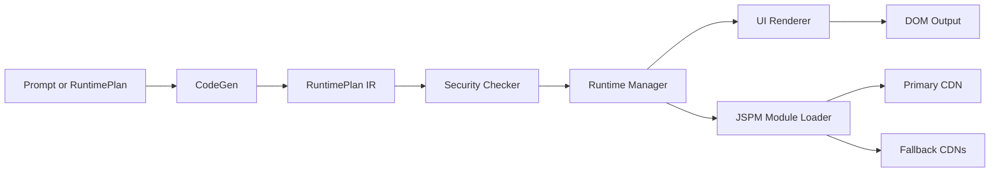
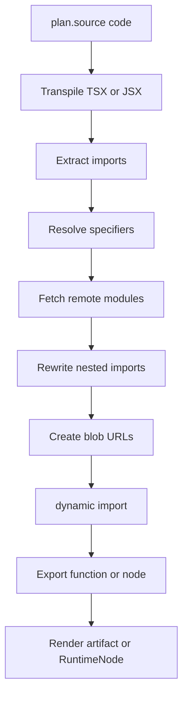
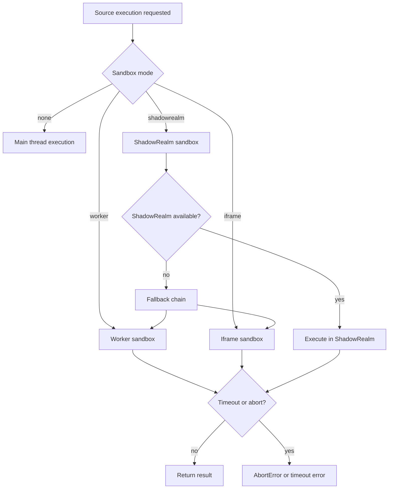
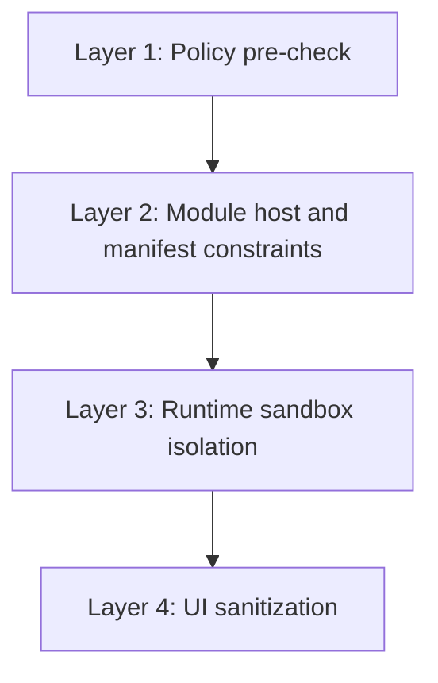

# Visual Architecture (Mermaid)

This document provides visual diagrams for the main Renderify architecture paths.

## End-to-End Pipeline



## Package Dependency Map

```mermaid
graph TD
  R[renderify] --> C[@renderify/core]
  R --> IR[@renderify/ir]
  R --> RT[@renderify/runtime]
  R --> S[@renderify/security]
  R --> L[@renderify/llm]

  C --> IR
  C --> RT
  C --> S

  RT --> IR
  RT --> S

  S --> IR

  CLI[@renderify/cli] --> R
  CLI --> C
  CLI --> L
  CLI --> RT
```

## Runtime Source Execution Path



## Sandbox Decision Flow



## Defense-in-Depth Security Layers



## Notes

- The diagrams intentionally show control flow, not every internal helper.
- For type-level details, see [`docs/api-reference.md`](./api-reference.md).
- For execution semantics, see [`docs/runtime-execution.md`](./runtime-execution.md).
