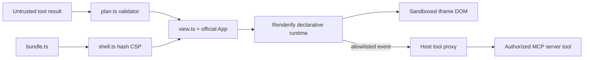

# MCP App runtime modules

## Scope

This inventory covers `packages/mcp-app/src` and the shared declarative-event
contract in IR, security, and runtime.

## Module responsibilities

| Module          | Responsibility                                                   | Not responsible for                              | Verification                           |
| --------------- | ---------------------------------------------------------------- | ------------------------------------------------ | -------------------------------------- |
| `plan.ts`       | JSON detach, size bound, and offline declarative validation      | Runtime rendering or MCP transport               | Plan corpus in `tests/mcp-app.test.ts` |
| `bundle.ts`     | Bundle the browser view as an inline-safe IIFE                   | HTML policy or server registration               | Default shell build and artifact smoke |
| `shell.ts`      | Escape configuration, hash scripts, and emit restrictive CSP     | Host iframe sandbox flags                        | CSP reconstruction tests               |
| `server.ts`     | Official resource/tool registration and result metadata          | Authentication or host capability implementation | Official in-memory SDK test            |
| `view.ts`       | Official lifecycle, rendering, context, tool allowlist, teardown | Arbitrary source or external modules             | Official AppBridge browser test        |
| IR event parser | Define the only declarative `onX` binding shape                  | DOM listener ownership                           | IR/security/runtime tests              |

## Dependency rationale

| Module           | Dependency                              | Why needed                                                       | Consumers / verification       |
| ---------------- | --------------------------------------- | ---------------------------------------------------------------- | ------------------------------ |
| `plan.ts`        | `@renderify/ir` + `@renderify/security` | RuntimePlan guards, tree walk, and shared URL inspection         | Server and view validators     |
| `bundle.ts`      | `esbuild`                               | Produce a self-contained browser IIFE and inline-script escaping | Shell builder                  |
| `server.ts`      | official MCP SDK + Apps helpers         | Normalize resource/tool metadata and SDK registrations           | MCP clients/servers            |
| `view.ts`        | official MCP Apps `App`                 | Own wire lifecycle and source-checked postMessage transport      | MCP host iframe                |
| `view.ts`        | `@renderify/runtime`                    | Execute state transitions and render RuntimeNodes                | Browser test                   |
| security/runtime | IR event parser                         | Keep validation and rendering semantics identical                | Strict declarative interaction |

## Dependency rules

- The view MUST depend on the official bridge, not a local protocol copy.
- Node-only shell/server modules MUST NOT enter the browser view bundle.
- The MCP boundary MUST remain narrower than the general trusted Renderify
  source APIs.
- Server tool authorization MUST remain outside the view.

## Boundary diagram

What this shows: only validated RuntimePlan data crosses from MCP results into
the offline runtime; server effects return through an explicit host proxy.

