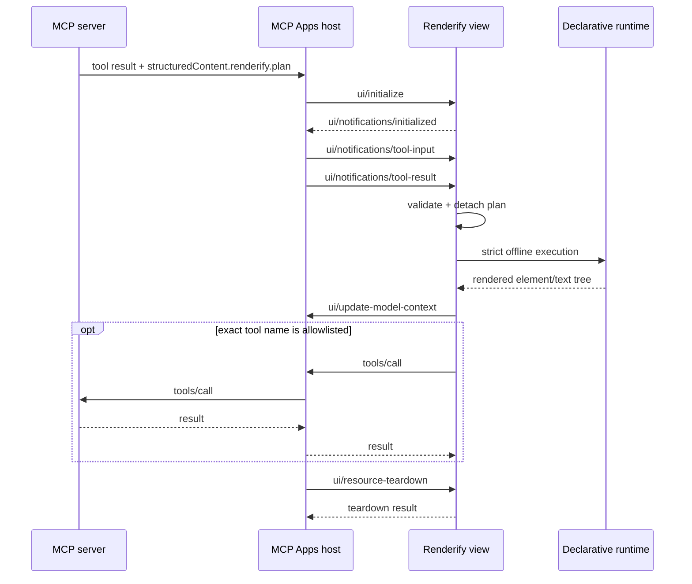

## Background & goals

MCP Apps standardizes how a tool associates an interactive `ui://` resource
with its result and how the view communicates with its host. Renderify supplies
the declarative UI runtime inside that envelope.

The first release MUST be portable across hosts and reviewable as a static
resource. It therefore accepts only offline `runtime-plan/v1` element/text
trees, uses the official MCP Apps SDK for protocol behavior, and emits a
self-contained HTML document.

## Non-goals

- Runtime JSX/TSX/JavaScript/TypeScript source execution.
- Component modules, package imports, CDN delivery, or declared-domain mode.
- Host implementation, authentication, authorization, or confirmation UX.
- A general postMessage protocol abstraction outside MCP Apps.

## User behavior

A server author registers a Renderify app and returns a plan from a tool
handler. A compatible host displays the resource and sends the result to the
view. Declarative buttons can update local state. An event prefixed with
`tool:` can call a server tool only when its exact name is in `allowedTools`.
Hosts without MCP Apps support retain the text content in the tool result.

## System behavior

What this shows: the host owns iframe isolation, the official bridge owns the
wire lifecycle, and Renderify validates the plan on both sides of that bridge.

## Business rules

- A plan MUST declare `specVersion: "runtime-plan/v1"`.
- The server and view MUST independently JSON-detach and validate the plan.
- `source`, component nodes, non-empty `imports`, non-empty `moduleManifest`,
  external modules, network hosts, timers, persistent storage, and non-standard
  execution profiles MUST be rejected.
- SVG animation and timed mutation elements MUST be rejected because they can
  change sanitized URL attributes after validation.
- Unsafe, remote, and external-navigation URL attributes MUST be rejected by
  the shared URL inspector before the tool result is returned.
- Fragment-only `href` values MUST be checked against the owning element.
  Navigation and resource-loading elements such as `a`, `area`, and SVG
  `image` MUST be rejected because `srcdoc` documents inherit the host page's
  base URL. Only explicit local-reference element/attribute pairs may pass.
- The default plan-size limit MUST be 512 KiB and MUST be bounded above by the
  implementation limit.
- The shell MUST declare zero external MCP resource/connect/frame domains and
  MUST use hashes for inline scripts without `unsafe-eval` or script
  `unsafe-inline`.
- The view MUST use official `App` and `PostMessageTransport` behavior, including
  parent-window source validation, initialization, model-context request shape,
  and teardown response handling.
- App-to-server tool calls MUST default to denied. Matching is exact and a host
  capability is required before a call is attempted.
- Model context MUST contain only plan identity, current state, and the last
  declarative event; it MUST NOT copy the entire plan or metadata.

## Permission rules

The resource requests no camera, microphone, geolocation, or clipboard
permission. An allowlisted tool name is routing permission only; each server
tool MUST still authenticate, authorize, validate arguments, and confirm
sensitive side effects according to its own policy.

## Data changes

No persistent data or migration is introduced. View state is in-memory and is
discarded on teardown. Model-context snapshots are host-owned after the view
sends them.

## API / event / schema changes

The source of truth is the public API under
[`packages/mcp-app/src/`](/packages/mcp-app/src/) and the official MCP Apps
schemas supplied by `@modelcontextprotocol/ext-apps`. The Renderify-specific
tool result field is `structuredContent.renderify.plan`.

Declarative `onClick` values are runtime event bindings, not inline JavaScript.
Parsing is shared by IR, security, and the renderer through
`parseRuntimeEventBinding` so those layers cannot disagree about the format.

## Technical design

The Node-side builder bundles the view as an IIFE, creates two exact SHA-256
script hashes, and inserts only escaped configuration JSON. The view runs the
strict Renderify security profile with empty module/network allowlists and
auto-pin disabled. `es-module-lexer` is imported lazily so declarative startup
does not initialize its WebAssembly parser under the strict CSP.
Provided browser bundles normalize CRLF/CR before hashing and reject null
characters because HTML parsing would replace them and invalidate the CSP hash.

See [ADR-0001](../../adr/0001-offline-declarative-mcp-app-boundary.md) for the
decision rationale and [runtime modules](../../architecture/mcp-app-runtime-modules.md)
for dependency ownership.

## Compatibility strategy

- Protocol behavior is delegated to the official SDK rather than copied.
- The resource includes modern nested `_meta.ui` metadata; the official helper
  also emits the legacy `ui/resourceUri` tool key for older hosts.
- The result always contains a model-readable text summary.
- `@renderify/mcp-app` is a new opt-in package and changes no existing embed API.

## Failure modes

- Invalid or over-limit plans render a generic rejection message and execute
  nothing.
- Missing MCP Apps support leaves the text summary available.
- Missing host tool capability or a non-allowlisted name performs no tool call.
- Model-context failure is recorded on the mount element and does not grant new
  capability or break local interaction.
- Teardown terminates the active runtime before the official response is sent.

## Test strategy

The detailed matrix is in [test-plan.md](test-plan.md). The load-bearing test is
the real Chromium test using official `AppBridge`, a sandboxed iframe, strict
CSP, source-spoof attempt, local state event, tool allowlist, model context, and
teardown.

## Rollout & rollback

The package is opt-in and begins at `0.1.0` through Changesets. Existing packages
receive patch releases for shared event parsing and lazy source-lexer startup.
See [rollout.md](rollout.md). Removing app registration restores text-only tool
behavior without a data rollback.

## Monitoring & alerts

The library emits no telemetry. Hosts can inspect `data-renderify-status`,
`data-renderify-tool-error`, `data-renderify-context-error`, and their MCP bridge
logs. CI treats protocol/browser failures and unexpected network requests as
release blockers.

## Reviewer focus

- Any widening of the accepted plan surface or CSP sources.
- Tool allowlist bypasses or confused-deputy behavior.
- Message-source validation and initialization/teardown ordering.
- Raw configuration reaching an inline script without JSON escaping.
- Browser bundles that eagerly initialize WebAssembly or make network requests.

## Agent constraints

An automated change MUST NOT enable source, imports, component nodes, external
domains, storage, timers, or arbitrary tool calls as a compatibility fix. Such a
change requires a new ADR, threat-model update, and browser security evidence.

## Verification

- Plan boundary and official server SDK: `pnpm exec tsx --test tests/mcp-app.test.ts`
- Official host bridge and Chromium boundary: `pnpm exec tsx --test tests/e2e/mcp-app.test.ts`
- Shared security behavior: `pnpm exec tsx --test tests/security.test.ts`
- Package surface: `pnpm build && pnpm artifacts:smoke`
