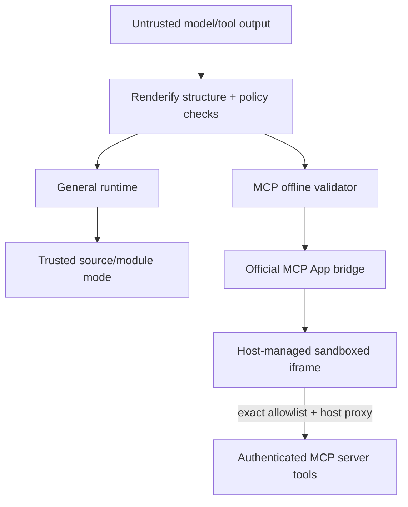

# Renderify threat model

## Scope

Renderify consumes model- or application-produced UI descriptions. A
`RuntimePlan`, its state, metadata, source, imports, and event payloads MUST be
treated as attacker-controlled unless the caller has established a stronger
trust relationship.

This document distinguishes the general Renderify runtime from the narrower
`@renderify/mcp-app` contract. The MCP package does not expose the general
runtime's trusted source path.

## Assets

| Asset | Security concern |
| --- | --- |
| Host DOM, cookies, and credentials | Script execution or sandbox escape could act as the user. |
| Data placed in plan/context/state | UI or model-context output could disclose it. |
| MCP server tools | A confused deputy could perform unauthorized side effects. |
| Network identity | Unexpected fetches could exfiltrate data or load code. |
| Module supply chain | Unpinned or unverified modules can replace executable code. |
| Availability | Large plans, repeated events, and runtime work can consume resources. |

## Trust boundaries

What this shows: direct trusted-source rendering and the offline MCP adapter
have different boundaries and MUST NOT be described as equivalent.

Trusted computing base for the MCP path: the host, browser sandbox/CSP
implementation, official MCP Apps SDK, the static shell, Renderify validators,
security checker, runtime manager, and UI renderer. A defect in those units can
invalidate the boundary.

## Attacker capabilities

The attacker may control the complete tool result plan, including text, tags,
attributes, local state, transitions, event types and payloads, and metadata.
They may send an over-limit or malformed payload, attempt active URLs or blocked
tags, request a sensitive tool, spoof a postMessage from another frame, mislead
the user, or repeat actions to consume CPU/memory.

For general trusted/relaxed runtime APIs, the attacker may also control source
and imports if the caller incorrectly treats model output as reviewed code.

## Defense layers and guarantee level

| Layer | Mechanism | Scope and strength |
| --- | --- | --- |
| IR guards | Plain-JSON shape, safe state paths, RuntimeNode traversal | Exact for the checked structure. |
| Security policy | Tags, URLs, capabilities, budgets, module policy | Exact for implemented checks; configuration can widen it. |
| Source pattern scan | Banned token/regex patterns | Best-effort only; not a JavaScript isolation boundary. |
| Declarative renderer | Tag/attribute/style/URL sanitization and delegated events | Applies to RuntimeNode rendering, not trusted Preact source output. |
| Runtime isolation profiles | Worker/iframe modes and fail-closed behavior | Depends on selected profile, browser, and host CSP. |
| MCP validator | Rejects source/modules/network/storage/timers and caps JSON size | Exact for the accepted MCP plan contract. |
| MCP shell CSP | Script hashes, no connection/worker/frame/object sources | Browser-enforced inside the resource when the host preserves it. |
| Host sandbox | Unique-origin iframe and permissions policy | Host-owned; the package declares needs but cannot force host flags. |
| Official transport | Valid JSON-RPC and `event.source === window.parent` | Rejects sibling-frame messages; target origin is `*` because sandbox origins may be opaque. |
| Tool allowlist | Exact view-side name match plus host capability | Routing gate only; server authentication/authorization remains mandatory. |

## MCP App-specific rules

- The shell and `_meta.ui.csp` declare no external origins or browser
  permissions.
- A 512 KiB default limit bounds accepted plan JSON; the host still receives
  the original MCP message before view validation.
- Strict policy limits depth, node count, transitions, and actions in addition
  to the MCP-specific exclusions.
- SVG animation and timed mutation elements are rejected so browser-managed
  updates cannot change a URL attribute after validation.
- Fragment-only hrefs are element-sensitive because a `srcdoc` app inherits
  the embedding page's base URL. Navigation and resource-loading elements may
  not use those hrefs; only explicit local SVG references and functional IRIs
  are accepted.
- CSS `image-set()` and `-webkit-image-set()` are rejected in URL-bearing
  attributes and inline styles because quoted candidates can load without a
  `url()` token; CSS escapes and comments are normalized before inspection.
- URL-bearing MCP attributes cannot contain runtime templates. Rejecting them
  before execution prevents state, context, or event interpolation from
  introducing a relative or active URL after the boundary check.
- Declarative `onClick` data becomes delegated runtime events. It never becomes
  an HTML `on*` attribute or evaluated JavaScript; case-variant event attribute
  names are rejected instead of falling through to HTML serialization.
- Runtime transition dispatch uses own-property lookup, so event names such as
  `constructor` and `__proto__` cannot resolve inherited prototype members as
  action lists.
- Model-context updates contain attacker-influenced state/event data. Hosts and
  models MUST treat it as untrusted context, not instructions with authority.
- Tool arguments originate in the plan. Servers MUST validate them and require
  confirmation for destructive or sensitive effects.
- The registration helper forwards the official request context so handlers can
  inspect transport-provided authentication, cancellation, session, and request
  metadata instead of relying only on attacker-controlled tool arguments.

## Residual risks

- Declarative text and layout can still phish or mislead a user.
- Repeated local transitions can grow state or consume browser resources until
  the host tears down the iframe.
- A weak or non-conforming host sandbox reduces containment; the inner CSP does
  not replace the outer iframe boundary.
- A compromised official dependency or Renderify TCB component can invalidate
  assumptions.
- The current evidence is automated testing, not a third-party security audit.
- General trusted/relaxed source modes remain trusted-code features and MUST NOT
  be inferred safe from the MCP declarative result.

## Out of scope

- A malicious MCP host or server.
- Browser engine vulnerabilities that bypass CSP or iframe isolation.
- Secrets deliberately copied by the host into plan/state.
- Authorization decisions inside application-specific tools.

## Reporting

Use the private process in [`SECURITY.md`](/SECURITY.md). High-value reports
include a minimal plan, selected profile, host sandbox/CSP, browser version, and
demonstrated impact.
